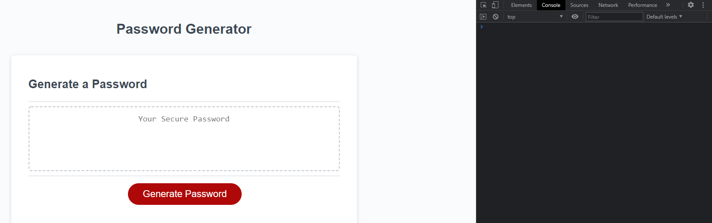
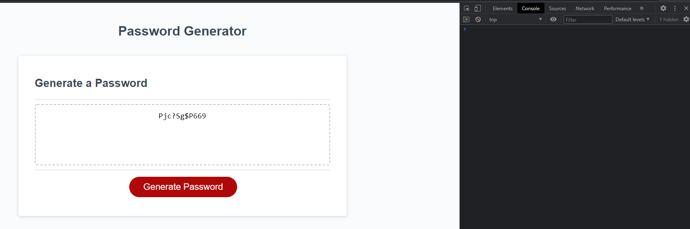

# Password Generator - HOW03

## Description

This password generator required me to make use of multiple concepts. I had to have prompts for different features of the password that the user could select, warnings or alerts if the user chose an invalid option, the actual logic to generate the password by pushing data and the options chosen into a new array, separate from the ones holding all of the available characters, and many if statements.

The completed version allows the user to generate a password between 8-128 characters, with options of uppercase, lowercase, numbers, and special characters.

## Screenshots

## Project Github Pages Link

[Deployed GitHub Pages Site](https://leon3005.github.io/Password_Generator/)
